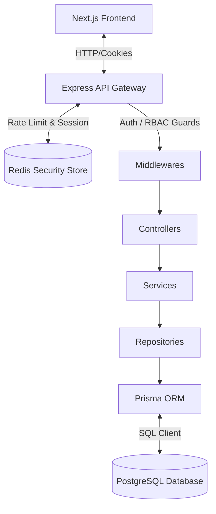

# Demo
https://drive.google.com/drive/folders/1lqExGTuHkJCqFgH7I52tUsdgIUW_ssYG
# TransitOps

### Smart Transport Operations Platform

TransitOps is a centralized fleet operations and transport logistics management platform designed to replace fragmented spreadsheets, manual trip sheets, and siloed tracking tools. By consolidating fleet management, maintenance schedules, and telemetry auditing into a unified interface, TransitOps provides transit operators with real-time operational visibility, strict business rule enforcement, and cross-departmental alignment.

Centralized operations are essential for modern transit networks to minimize downtime, prevent resource scheduling conflicts, audit telematics data, and monitor compliance. TransitOps addresses these challenges directly through a robust modular architecture, backend policy validation, and role-specific dashboards tailored for Fleet Managers, Dispatchers, Safety Officers, and Financial Analysts.

---

## 1. Problem Statement

Modern logistics networks face recurring operational bottlenecks due to fragmented tracking and manual data entry:
- **Scheduling Conflicts & Over-Allocation**: Double-assigning vehicles or drivers to overlapping trips.
- **Operational Blindspots**: Running vehicles that require urgent maintenance or exceeding load limits.
- **Untracked Downtime**: Missing scheduled checkups, leading to preventable breakdowns and high repair costs.
- **Compliance & Telemetry Slippage**: Failing to monitor speed limit infractions, harsh braking, and driver telemetry alerts.
- **Fragmented Data**: Disconnected logs for fleet expenses, fuel efficiency, and route budgets.

TransitOps solves these issues by establishing a single source of truth for the transit ecosystem. The platform locks down workflows with automated business rules (e.g. preventing vehicles under maintenance from being dispatched), automates vehicle transitions, and provides department-wide monitoring feeds.

---

## 2. Key Features

The following features are **fully implemented** and functional in the repository:

### 🔐 Authentication & Authorization
- **Session-Based Authentication**: Custom cookie-backed session storage (`sid`) managed via Redis—fully revocable (no JWTs).
- **Role-Based Access Control (RBAC)**: Backend route middleware validation checking roles against pre-seeded profiles (`Fleet Manager`, `Dispatcher`, `Safety Officer`, `Financial Analyst`).
- **Autofill Helper**: Dropdown selector on the login portal to immediately sign in as any pre-seeded role.
- **Secure Password Reset**: Multi-step verification flow utilizing 6-digit OTP codes sent via email/SMTP (with console-logging fallbacks for local environments).
- **Account Lockout**: 5 failed login attempts trigger a 15-minute lockout, tracked per-user in Redis.
- **Rate Limiting**: Redis-backed rate limiters on login, forgot-password, verify-OTP, and reset-password endpoints to prevent brute-force attacks.

### 🚛 Vehicle Registry
- **Master Fleet Database**: Register, edit, and delete vehicles with inputs for registration number (unique), name/model, type, load capacity, odometer, and acquisition cost.
- **Advanced Query Filters**: On-the-fly searching by registration number, filtering by vehicle type, and status filtering (`AVAILABLE`, `ON_TRIP`, `IN_SHOP`, `RETIRED`).
- **Conflict Prevention**: Displays real-time validation feedback (e.g., duplicate registration numbers, capacity $\le 0$).

### 🔧 Maintenance Management
- **Downtime Scheduling**: Log maintenance events (Oil Change, Brake Repair, Engine Overhaul, etc.) specifying costs and start dates.
- **Automated Vehicle Lockout**: Registering an `ACTIVE` maintenance log automatically transitions the target vehicle's status to `IN_SHOP`.
- **Downtime Release**: Closing a maintenance ticket (`CLOSED`) automatically restores the vehicle status back to `AVAILABLE`.
- **Logs Auditing**: Maintenance table with sorting, pagination, and status filters.

### ⛽ Fuel Tracking
- **Fuel Purchase Logs**: Record fuel purchases per vehicle with liters, cost per liter, total cost, and date.
- **Trip Linking**: Optionally link fuel transactions to specific trips for per-route efficiency analysis.
- **Efficiency Metrics**: Track fuel efficiency trends and odometer updates per vehicle.

### 💰 Expense Management
- **Miscellaneous Costs**: Log per-vehicle expenses categorized as Toll, Parking, Fine, or Other.
- **Cost KPI Segregation**: Operational cost KPIs derived from fuel and maintenance only—miscellaneous expenses tracked separately for auditing.

### 👥 Driver & Safety Management (Safety Officer Role)
- **Safety & Compliance Hub**: KPI overview (Total Drivers, Available, Expiring Soon, Suspended) with bar chart for driver status distribution and pie chart for license validity breakdown.
- **Driver Records**: Full CRUD with search, filters (status, category, expiry), and sortable columns (name, expiry, safety score). Status management dropdown with manual overrides (ON_TRIP is locked to trip lifecycle).
- **License Expiry Tracking**: Highlight and countdown tracking for expiring and expired commercial driver licenses; auto-suspension for expired licenses with email renewal reminders.
- **Safety Rating System**: Per-trip driver safety ratings (1–5) submitted by Dispatchers, averaged into an overall driver safety score. Top 5 leaderboard displayed on the dashboard.
- **License Weight Enforcement**: Business rules enforce `LMV_TR` ≤ 7,500 kg, `MGV` ≤ 12,000 kg, `HMV` > 12,000 kg; higher categories cover lower ones.
- **Compliance View**: Drivers grouped by risk tier—Compliant, Expiring Soon, Non-Compliant (expired), and Suspended—for rapid auditing.
- **Trips Tracking**: Read-only trips page with Leaflet.js map visualization and filterable trip table for monitoring driver activity.
- **License Validation**: On-demand batch validation endpoint to scan all drivers and auto-suspend those with expired licenses.

### 📋 Dispatch Management (Dispatcher Role)
- **Dispatcher Control Console**: Centralized dashboard showing trip counts (Draft, Dispatched, Completed, Cancelled) and real-time resource availability (available drivers & vehicles).
- **Kanban Dispatch Board**: Drag-and-drop trip cards across DRAFT → DISPATCHED → COMPLETED / CANCELLED columns with status transition validation.
- **Create Trip Wizard**: Plan routes with OSRM auto-calculated distances, assign vehicles with cargo weight validation, and select drivers filtered by license category vs vehicle weight class (with a recommended badge for best match).
- **Trip Completion & Fuel Logging**: Record final odometer, fuel consumed (liters), and fuel cost upon trip completion.
- **Post-Trip Safety Rating**: Prompt to rate driver safety (1–5 stars) immediately after completing a trip.
- **Conflict Prevention**: Prevents dispatching vehicles in `IN_SHOP` or `RETIRED` status; enforces cargo weight ≤ vehicle capacity.
- **Expense Linking**: Per-trip expense tracking alongside dispatch logs.

### 📊 Role-Specific Dashboards
Each role lands on a dedicated dashboard after login with tailored KPIs and tools:

- **Fleet Manager**: Live vehicle status aggregates, interactive operations & cost dashboards, registry grid, and charts (vehicle status distribution, vehicles by type, fleet utilization, regional distribution, maintenance cost by type).
- **Dispatcher**: Dispatcher Control Console with trip status KPIs, resource availability panels, and quick-access "Create Trip" button. Full Kanban dispatch board for managing trip lifecycle.
- **Safety Officer**: Safety & Compliance Hub with driver KPI cards, license validity & status distribution charts, Safety Score Leaderboard, License Expiry Watchlist, and navigation to Drivers, Compliance, and Trips pages.
- **Financial Analyst**: Evaluates operational budgets, expenditures, and cost variances.

---

## 🗺️ Product Roadmap

The following status tracks our modular milestones:

| Feature Area | Status | Technical Strategy |
| :--- | :--- | :--- |
| **Driver Management** | ✅ *Implemented* | Introduced `Driver` entity with license numbers, expiration dates, and compliance states. |
| **Trip Dispatch** | ✅ *Implemented* | Added `Trip` model linking drivers, vehicles, cargo weights, routes, and dispatch status transitions. |
| **Fuel Tracking** | ✅ *Implemented* | Created `FuelLog` model to track transactions, efficiency metrics, and odometer updates. |
| **Expense Tracking** | ✅ *Implemented* | Created `Expense` model for per-vehicle miscellaneous costs (Toll, Parking, Fine, Other) with cost KPI segregation. |
| **Telemetry Charts** | ✅ *Implemented* | Incorporated interactive Chart.js and Recharts widgets to plot fuel, cost variance, and fleet utilization trends. |
| **Leaflet Maps** | ✅ *Implemented* | Integrated Leaflet.js and OpenStreetMap to render dispatch locations and track active vehicle routes. |
| **Excel/PDF Export** | ✅ *Implemented* | Added backend Puppeteer worker services and client-side jsPDF/xlsx for audit-ready compliance sheets, financial summaries, and exports. |

---

## 3. Business Rules Enforced in Code

The system enforces strict operational logic to maintain database integrity and workflow safety:

1. **Unique Registration**: Duplicate vehicle registration numbers are blocked at the database level and handled gracefully in the frontend UI.
2. **Maintenance Lockout**: Setting a maintenance log to `ACTIVE` changes the vehicle status to `IN_SHOP`, making it unavailable for operational assignment.
3. **Maintenance Release**: Closing a maintenance ticket (`CLOSED` status) returns the vehicle to `AVAILABLE`.
4. **Invalid Numeric Inputs**: Load capacities must be $> 0$ (up to $30,000$ kg); odometers (up to $1,500,000$ km) and acquisition costs (up to $₹10,00,00,000$) must be $\ge 0$.
5. **Session Safety**: Password resets immediately invalidate and delete all active Redis sessions for the target user.
6. **Account Lockout**: 5 consecutive failed login attempts lock the user out for 15 minutes (tracked in Redis).
7. **Rate Throttling**: Login, forgot-password, verify-OTP, and reset-password endpoints are throttled with Redis-backed rate limiters.
8. **License–Weight Matching**: `LMV_TR` licenses are restricted to vehicles ≤ 7,500 kg, `MGV` to ≤ 12,000 kg, and `HMV` covers all heavier vehicles.
9. **Auto-Suspension**: Drivers with expired licenses are automatically moved to `SUSPENDED` status, preventing dispatch assignment.

---

## 4. System Architecture

TransitOps follows a **Modular Monolithic** design pattern structured for quick deployment and horizontal scalability:



### Request Lifecycle Flow
1. **Client**: The Next.js frontend sends credentials or queries to the API gateway.
2. **Middleware**: Express middlewares handle session retrieval from **Redis**, rate limiting, and RBAC authorization verification.
3. **Controller**: Translates HTTP parameters into clean Javascript objects.
4. **Service**: Encapsulates business rules, input validations, state transitions, and calculations.
5. **Repository**: Executes raw queries and interacts with the **Prisma ORM**.
6. **Database**: PostgreSQL persists data transactions securely.

---

## 🐳 DevOps & Infrastructure Guide

TransitOps is configured with a modern containerized DevOps pipeline designed for local reproducibility, performance optimization, and secure state management.

### 1. Docker Compose Orchestration
The entire application stack is orchestrated via [docker-compose.yml](file:///c:/Users/Rishabh%2520Jain/Desktop/github/odoo_hackathon_2026/docker-compose.yml):
- **Service Dependency Graph**: `frontend` depends on `backend`, which in turn depends on `db` and `redis`. This prevents microservice startup race conditions.
- **Persistent Data Volume**: The PostgreSQL container mounts `postgres_data` mapping to `/var/lib/postgresql/data`, guaranteeing database transactions survive container teardowns.
- **Entrypoint Handlers**: The backend bootstrap command generates Prisma clients on-the-fly (`npx prisma generate`), applies schema modifications without complex migration bottlenecks (`npx prisma db push --accept-data-loss`), and executes idempotent database seeding (`node prisma/seed.js`).

### 2. State & Session Management (Redis Caching)
- **Opaque Session Tokens**: Rather than transmitting sensitive claims in stateless JWTs (which cannot be revoked on-demand), TransitOps implements stateful session-based auth.
- **Revocability Security**: User sessions are mapped to temporary `sid` tokens in Redis. Password resets immediately invalidate all sessions by wiping matching keys in Redis, neutralizing session hijack vectors.
- **Rate Throttling**: Express rate limiters write directly to Redis using `rate-limit-redis`, providing shared rate-limiting state across backend servers.

### 3. Database Layer & Performance Optimizations (Prisma + PostgreSQL)
- **Driver Adapter Pattern**: Configured with Prisma v7 using `@prisma/adapter-pg` to wrap the `pg` client and pass database credentials from the docker-compose environment variables securely.
- **Database Mapping**: Database tables explicitly map to snake_case names using `@@map` declarations in [schema.prisma](file:///c:/Users/Rishabh%2520Jain/Desktop/github/odoo_hackathon_2026/backend/prisma/schema.prisma) to support SQL conventions.
- **Composite Indexing**: 
  - Added `@@index([type, status])` composite index to speed up registry filtering.
  - Added `@@index([createdAt])` index to optimize search and sorting pagination speeds.
  - Added foreign key index `@@index([roleId])` inside the `User` model to speed up joins when retrieving user roles.

### 4. Database Administration (pgAdmin)
- **pgAdmin 4** is included as a Docker service for database inspection and query execution.
- Access it at `http://localhost:5050` and configure a connection to the `db` host on port `5432`.

### 5. Environment Variables Interpolation
Security tokens, port configurations, and system endpoints are decoupled from code and injected at startup. Variables inside [docker-compose.yml](file:///c:/Users/Rishabh%2520Jain/Desktop/github/odoo_hackathon_2026/docker-compose.yml) interpolate root `.env` properties, forwarding host configurations (such as SMTP credentials or database connections) down to the internal service layers.

### 6. Next.js Compile Optimization (Turbopack)
- The Next.js frontend is built using Next.js 16 and Next Turbopack to deliver fast compilation, optimized asset bundling, and minimal build payloads.
- Layouts and views split static pages (e.g. `/dashboard/fleet-manager`) from dynamic segment routes (e.g. `/dashboard/safety-officer/driver/[id]`) for fast client loading and high-fidelity rendering.

---

## ⚙️ Getting Started

1. **Clone and Configure**:
   Create a `.env` in the root matching [.env.example](file:///c:/Users/Rishabh%20Jain/Desktop/github/odoo_hackathon_2026/.env.example):
   ```bash
   POSTGRES_USER=myuser
   POSTGRES_PASSWORD=mypassword
   POSTGRES_DB=mydatabase
   DATABASE_URL=postgresql://myuser:mypassword@db:5432/mydatabase?schema=public
   SMTP_HOST=smtp.gmail.com
   SMTP_PORT=587
   SMTP_USER=your_email@gmail.com
   SMTP_PASS=your_app_password
   SMTP_FROM="TransitOps <your_email@gmail.com>"
   ```

2. **Boot the Containers**:
   ```bash
   docker-compose up --build
   ```

3. **Verify the Ports**:
   - Access the Client Portal: `http://localhost:3000`
   - Access the API: `http://localhost:5000/health`
   - Access pgAdmin: `http://localhost:5050`
   - Access Redis: `localhost:6379`
  
